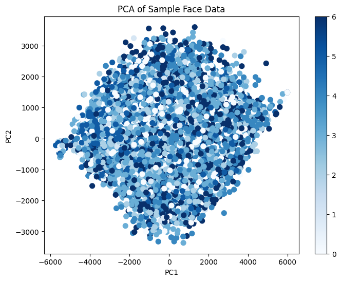
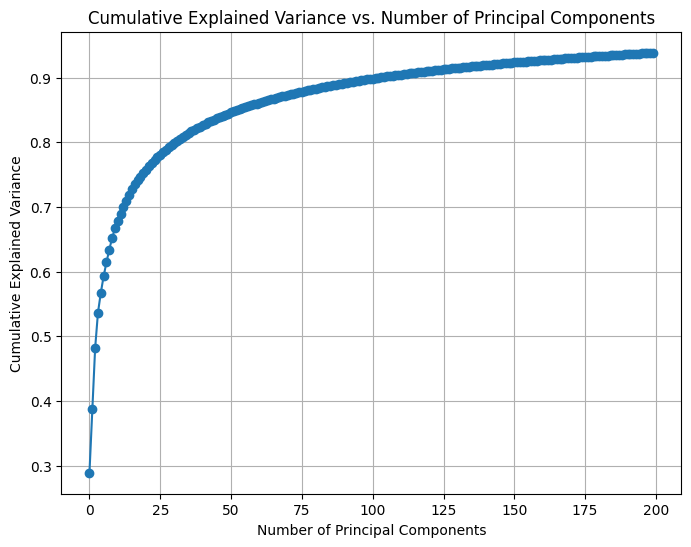

# Mini-Project for Fundamentals of Machine Learning Course

This repository contains the code and data for a mini-project on facial expression recognition using machine learning algorithms.

## 📑 Project Policy
- Team: group should consist of 3-4 students.

    |No.| Student Name    | Student ID |
    | --------| -------- | ------- |
    |1|Phạm Ngọc Hùng|21280017|
    |2|Hoàng Phúc|21280105|
    |3|Phan Huy Thịnh|21280109|
    |4|||

- The submission deadline is strict: **11:59 PM** on **June 22nd, 2024**. Commits pushed after this deadline will not be considered.

## 📦 Project Structure

The repository is organized into the following directories:

- **/data**: This directory contains the facial expression dataset. You'll need to download the dataset and place it here before running the notebooks. (Download link provided below)
- **/notebooks**: This directory contains the Jupyter notebook ```EDA.ipynb```. This notebook guides you through exploratory data analysis (EDA) and classification tasks.

## ⚙️ Usage

This project is designed to be completed in the following steps:

1. **Fork the Project**: Click on the ```Fork``` button on the top right corner of this repository, this will create a copy of the repository in your own GitHub account. Complete the table at the top by entering your team member names.

2. **Download the Dataset**: Download the facial expression dataset from the following [link](https://mega.nz/file/foM2wDaa#GPGyspdUB2WV-fATL-ZvYj3i4FqgbVKyct413gxg3rE) and place it in the **/data** directory:

3. **Complete the Tasks**: Open the ```notebooks/EDA.ipynb``` notebook in your Jupyter Notebook environment. The notebook is designed to guide you through various tasks, including:
    
    1. Prerequisite
    2. Principle Component Analysis
    3. Image Classification
    4. Evaluating Classification Performance 

    Make sure to run all the code cells in the ```EDA.ipynb``` notebook and ensure they produce output before committing and pushing your changes.

5. **Commit and Push Your Changes**: Once you've completed the tasks outlined in the notebook, commit your changes to your local repository and push them to your forked repository on GitHub.


Feel free to modify and extend the notebook to explore further aspects of the data and experiment with different algorithms. Good luck.

### **Question 1:** Can you visualize the data projected onto two principal components? (2 points)



### **Question 2:** How to determine the optimal number of principal components using pca.explained_variance_? Explain your selection process. (2 points)




   #### **To determine the optimal number of principal components, I follow these step:

   
   1. **Perform PCA**: Fit a PCA model to the dataset and capture the explained variance for each principal component.
      
   2. **Calculate Explained Variance Ratios**: The `explained_variance_ratio_` attribute of the PCA object provides the proportion of the dataset's variance that each principal component explains.
      
   3. **Calculate Cumulative Explained Variance**: The cumulative sum of the explained variance ratios helps to understand the total variance captured as more principal components are added.
   
   4. **Plot Cumulative Explained Variance**: Plotting the cumulative explained variance against the number of principal components allows for visual identification of the "elbow point."
   
   5. **Identify the Elbow Point**: The optimal number of principal components is often at the "elbow point" in the plot, where the explained variance starts to level off. Adding more components beyond this point results in only a small increase in the explained variance.

   6. **Select Number of Components**: Choose the number of components that capture a significant portion of the total variance (typically around 90-95%).

   #### **Explanation of the Selection Process for the Optimal Number of Principal Components**
   

   1. **Explained Variance Ratio**: Measures the amount of variance each principal component captures from the original data.

   2. **Cumulative Explained Variance**: The cumulative sum of the explained variance ratios, showing the total variance captured as more components are added.

   3. **Elbow Point:** Look at the plot of cumulative explained variance versus the number of components. The "elbow point" is where the curve starts to flatten out. This indicates diminishing returns in terms of explained variance as more components are added.

   4. **Threshold:** Choose the number of principal components that capture a significant portion of the total variance, typically around 90-95%. This threshold ensures that you retain most of the dataset's information while reducing dimensionality.

       
   #### **Base on the plot:**
   
   The cumulative explained variance plot shows that the first 25-50 principal components capture the most significant variance, with the curve flattening beyond this point. Selecting 100 components, which explains about 90% of the total variance, strikes an optimal balance. This choice retains most essential information while efficiently reducing dimensionality, as additional components contribute only marginally to the variance.
