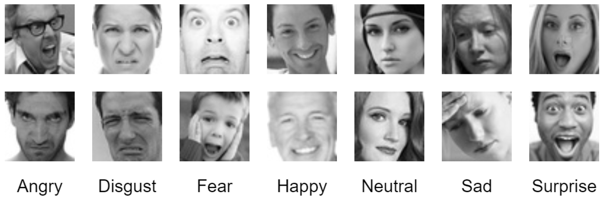
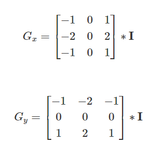
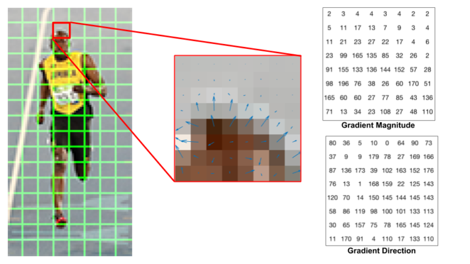
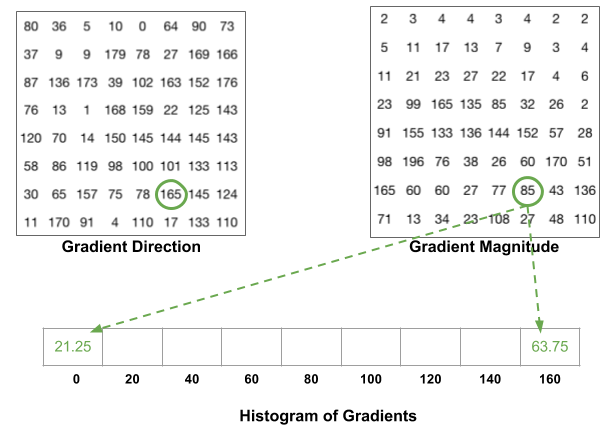
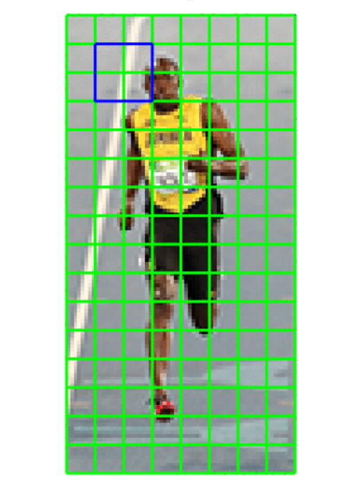
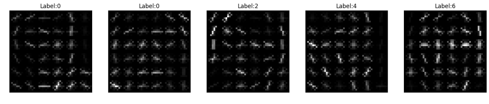
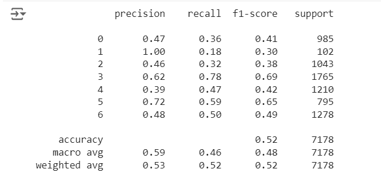
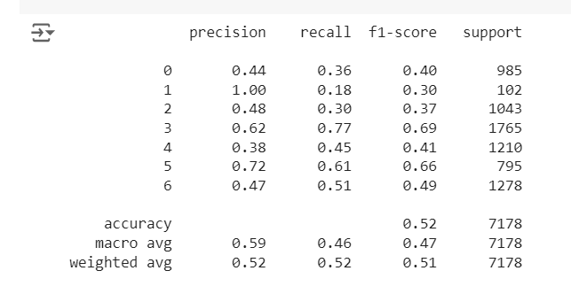
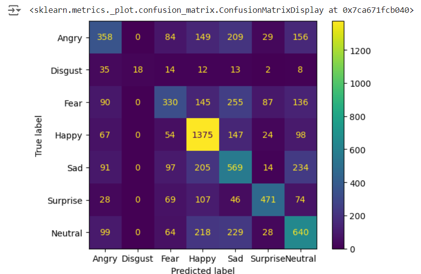

# Facial Expression Recognition using Machine Learning


Mini-project developed for the Fundamentals of Machine Learning course, focusing on facial expression recognition using machine learning algorithms.

## 📑 Project Policy
- Team consist of 3-4 students.

    |No.| Student Name    | Student ID |
    | --------| -------- | ------- |
    |1|Phạm Ngọc Hùng|21280017|
    |2|Hoàng Phúc|21280105|
    |3|Phan Huy Thịnh|21280109|

## 📦 Project Structure

The repository is organized into the following directories:

- **/data**: This directory contains the facial expression dataset. You'll need to download the dataset and place it here before running the notebooks. (Download link provided below)
- **/notebooks**: This directory contains the Jupyter notebook ```EDA.ipynb```. This notebook guides you through exploratory data analysis (EDA) and classification tasks.

## 1. Principle Component Analysis

### **Question 1:** Can you visualize the data projected onto two principal components? (2 points)


### **Question 2:** How to determine the optimal number of principal components using pca.explained_variance_? Explain your selection process. (2 points)


**To determine the optimal number of principal components, we need to:**   
   1. **Perform PCA**: Fit a PCA model to the dataset and capture the explained variance for each principal component.
      
   2. **Calculate Cumulative Explained Variance**: The cumulative sum of the explained variance ratios helps to understand the total variance captured as more principal components are added.
   
   3. **Plot Cumulative Explained Variance**: Plotting the cumulative explained variance against the number of principal components allows for visual identification of the "elbow point."
   
   4. **Identify the Elbow Point**: The optimal number of principal components is often at the "elbow point" in the plot, where the explained variance starts to level off. Adding more components beyond this point results in only a small increase in the explained variance.

   5. **Select Number of Components**: Choose the number of components that capture a significant portion of the total variance (typically around 90-95%).

$\Longrightarrow$ Based on the plot: The cumulative explained variance plot shows that the first 25-50 principal components capture the most significant variance, with the curve flattening beyond this point. Selecting 100 components, which explains about 90% of the total variance, strikes an optimal balance. This choice retains most essential information while efficiently reducing dimensionality, as additional components contribute only marginally to the variance.

## 2. Image Classification

### 2.1 Histogram of Oriented Gradient as a way of Feature Selection
Because the original size of image is (48, 48), which is (2304, ) if flatten can lead to high complexity of model and expensive computation, also machine learning algorithms won't work well for high - dimensional data ('the curse of dimensionality'), so we can think of 2 ways:
  - Resize image into smaller size, but after experimenting, we see that the resized image doesn't look similar to the original image, and it still prone to fall into having redundant pixels.
  - Using techniques to detect relevant features like edge of nose, mouth,.. which can capture the emotion. First we think of Supervised Fine-Tuning but have not found  Pretrained Model on grayscale image. So here we consider the classic technique call **Histogram of Oriented Gradient (HOG)**. The basic idea behind HOG is to describe the appearance and shape of an object in an image by capturing the distribution of gradient orientations (or edge directions) within localized portions of the image. Here we will go through the steps to show how it can select relevant feature and reduce the dimensionality as simple as possible
    - **The idea of using Gradient**: Compute the gradient of the image in both the x (horizontal) and y (vertical) directions. The gradients are typically calculated using simple ***convolution kernels*** such as the Sobel operator. Compute Gradient Magnitude by $G = \sqrt{G_x^2 + G_y^2}$ and Gradient Orientation by $\theta = \text{acrtan}(\frac{G_y}{G_x})$ . By this way, we can capture the low - level and relevant features.

        
    - **Cell Division**:  Divide the image into small connected regions called cells. A common choice for the cell size is $8 \times 8$ pixels. So there will be $6 \times 6 = 36$ cells ($48 / 8 = 6$)
        
    - **Orientation Binning**: Typically, the gradient directions are binned into 9 bins, which are $[0, 20], ... [160, 180]$. In each cell of size $8 \times 8$ above, we map the Gradient Magnitude into those bins and receive a 1-d array of size 9 

        

    - **Normalization**: To account for illumination variations and contrast changes, normalize the histogram of each cell. This is done by grouping cells into larger regions called blocks. A typical choice is $2 \times 2$ blocks. We have $6 \times 6$ grid of cells, resulting in $(6 - 1) \times (6 - 1) = 25$ blocks (overlapping)

        
    - **Feature Vector Assembly**: Finally, notice that there are 25 blocks, each has 4 cells inside it, resulting in a 1-d array of size $25 \times 4 \times 9 = 25 \times 36 = 900$. That's how it is done.

- Result after using HOG:
        

### 2.2 Compare the performance of 4 different classification algorithms (3 machine learning and 1 MLP models) in both formats above. (4 points)

- We have experimentd MLP Classifier along with 3 Machine Learining Algorithm: Random Forest, XGBoost and Support Vector Classifier in both formats: Original data (feature processed by HOG) and PCA data
- We compared the performance on 2 formats and see that they are approximately same as each other, here we use ```SVC``` result for demonstration
- After performing tuning in all 4 models, we seen an increased in all models accuracy (ảound 0.05 to 0.1 score) with SVC still the best perform among these 4 models. More on how we choose what we decide to tune can be viewed in EDA notebook file

<figure>
  
  <figcaption>SVC on original data</figcaption>
</figure>

<figure>
  
  <figcaption>SVC on PCA data</figcaption>
</figure>

## 3. Evaluation Classification Performance
**Compare the performance of the different classification models using various metrics: accuracy, precision, recall, and F1-score. Based on the evaluation metrics, explain which model performs best and why. Identify the emotion category where the model makes the most accurate and most errors. (1 point)**
- The classification report (aggregated on original data (feature processed by HOG), weighted average of classes) and Confusion matrix are as follow: 
    |No.| Model Name    | Precison | Recall | F1-Score | 
    | --------| -------- | -------- | -------- | -------- |
    |1| SVC | 0.528| 0.524| 0.515 |
    |2| XGBClassifer |0.498| 0.498| 0.491 |
    |3| MLPClassifer |0.442 | 0.445 | 0.442 | 
    |4| RandomForestClassifier |0.475| 0.461| 0.441 |

    
<figure>
  
  <figcaption></figcaption>
</figure>


- We choose ```F1-Score``` as main metric since this dataset has imbalance among its classes which makes ```Precision``` and ```Recall``` not so reliable, as we can see the high in ```Precision``` is due to class 1 (```disgust```) - the imbalanced class 
- We easily see that ```SVC``` is the most competitive among 4 models, whose ```F1-Score``` (overall for 7 classes) is highest among all. We can increase the performance of other models by tuning but need to take into consideration of more  hyperparamters than that of ```SVC```

- The most accurate and most erroroneous class predicted by models: 
    - In term of ```F1-score``` and ```Recall```, class 3 (```Happy```) has highest score, this may result from many factors, one of them is that class 3 is the class having highest number of samples so  models could learn many from it.  We couldn't identify class with lowest in these scores. 
    - In term of ```Precison```, class 1 (```Disgust```) has highest score most of the time (apart from MLP Classifier's result), but ```Recall``` of it is significantly low. This  suggests that while the model is very accurate when it predicts this class (i.e., few false positives), it is missing many instances of this class (i.e., many false negatives). We couldn't identify class with lowest score.


## 4.Reference

- [Guide on how to tuning MLPClassifier](medium.com/@cemanahuacstrategies/tuning-the-mlpclassifier-in-scikit-learn-to-outperform-classic-models-437b80d7687c)
- [Guide on how to tuning XGBoost](towardsdatascience.com/xgboost-fine-tune-and-optimize-your-model-23d996fab663)
- [Guide on how to tuning RForest](https://towardsdatascience.com/hyperparameter-tuning-the-random-forest-in-python-using-scikit-learn-28d2aa77dd74)
